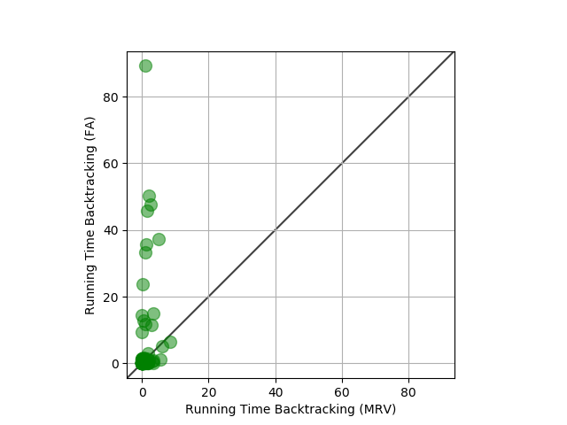

# Sudoku-Solver
Implemented Backtracing and AC3 Algorithms to solving sudoku puzzle.


### How to run:
```
pip install -r requirements.txt
python3 sudokuSolver.py
```

### Results
MRV - minimum remaining heuristic vs FA (first available)

